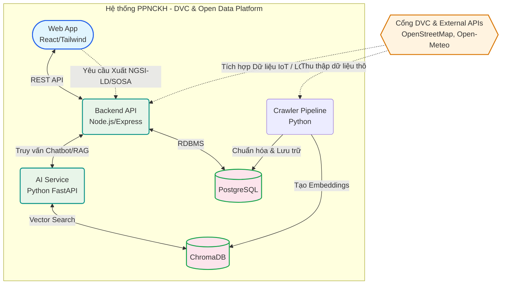

# PPNCKH - Hệ thống Tra cứu Dịch vụ công bằng AI và Dữ liệu Mở (OLP 2025)

[](https://opensource.org/licenses/MIT)
[](CHANGELOG.md)
[](CONTRIBUTING.md)

Đây là dự án phát triển Hệ thống Trợ lý ảo AI & Tra cứu Dịch vụ công (DVC) được thiết kế đặc biệt đáp ứng **Chủ đề Phần mềm nguồn mở Olympic Tin học 2025: "Ứng dụng dữ liệu mở liên kết phục vụ chuyển đổi số"**. 

Dự án giải quyết bài toán thực thực tế: **Minh bạch hóa và hỗ trợ người dân tự động hóa việc hỏi đáp thủ tục hành chính, đồng thời tích hợp chặt chẽ việc truy xuất dữ liệu theo chuẩn Semantic Web và vạn vật kết nối (IoT).**

## Trải nghiệm Live Demo (Bản dùng thử cho Giám Khảo)

Hệ thống hiện đang được triển khai qua kết nối Public (Ngrok). Bạn hoàn toàn có thể test trực tiếp tính năng Hệ thống Trợ lý Dịch vụ Công tại liên kết dưới đây mà không cần cài đặt:
👉 **[Nhấn vào đây để xem Live Demo OLP 2025](https://retired-king-plunder.ngrok-free.dev/)**
*(Lưu ý: Liên kết mang tính chất demo và có thể gián đoạn nếu máy chủ local bảo trì. Nếu lỗi, vui lòng xem mục Cài đặt nhanh ở bên dưới).*

## 🌟 Tính Năng Nổi Bật & Chuẩn Công Nghệ

1. **Trợ lý Ảo AI (RAG System)** 
   Sử dụng RAG (Retrieval-Augmented Generation) kết hợp ChromaDB và Gemini/LLM để tư vấn rành mạch các bước làm hồ sơ cho người dân.
2. **Mạng Dữ liệu Mở Liên kết (LOD)** 
   Dữ liệu được làm giàu (crawl trực tiếp từ Cổng DVC Quốc gia) và xuất khẩu công khai dưới định dạng **JSON-LD** (`schema.org/PublicService`). Không chỉ hiển thị, hệ thống cho phép các tổ chức thứ ba liên kết lấy siêu dữ liệu.
3. **FIWARE NGSI-LD & Smart City**
   Bảo đảm đáp ứng xu hướng Đô thị thông minh (Smart City). Tích hợp endpoint REST xuất danh mục dưới chuẩn NGSI-LD (ETSI).
4. **Ontology SOSA/SSN cho IoT**
   Giải quyết trọn vẹn yêu cầu công nghệ IoT mở rộng. Từng Cơ quan hành chính đều gắn tọa độ địa lý dựa trên OpenStreetMap và liên kết thời gian thực với dữ liệu thời tiết (Sensors) thông qua cấu trúc Ontology SOSA/SSN.

## 🏗 Kiến Trúc & Cấu Trúc Dự Án (Microservices)

### Sơ đồ Kiến trúc Hệ thống
Hệ thống được thiết kế theo kiến trúc Microservices, tách biệt rõ ràng các luồng thu thập dữ liệu, xử lý RAG và cung cấp API chuẩn NGSI-LD. Hình dưới đây mô phỏng luồng giao tiếp tương tự như các hệ thống Smart City:



### Cấu trúc Thư mục Code
```plaintext
PPNCKH/
├── frontend/          # React 18 + TailwindCSS + React Router (Giao diện người dùng cuối & Nút Export LOD)
├── backend/           # Node.js + Express.js REST API (Xử lý Context NGSI-LD/SOSA & Map Data DB)
├── ai-service/        # Python FastAPI + LangChain ChromaDB (Service RAG)
├── crawler/           # Pipeline Auto-Crawl DVC Quốc Gia (Thành phần Crawler Data pipeline)
├── database/          # PostgreSQL schema và Init files
├── docker-compose.yml # Containerization chuẩn hóa
└── Makefile           # Script biên dịch tự động
```

## 🚀 Cài Từ Đầu Đến Chạy Được

Repo hiện hỗ trợ 2 cách chạy:

- `Docker`: nhanh nhất nếu bạn muốn dựng toàn bộ stack trong container.
- `Local Windows`: phù hợp khi cần code, debug và demo trực tiếp trên máy.

Không nên trộn hai cách trong cùng một lần cài đặt, vì port và biến môi trường giữa `docker-compose` và môi trường local khác nhau.

### 1. Yêu cầu hệ thống

#### Chạy bằng Docker
- Docker Desktop
- Docker Compose

#### Chạy local trên Windows
- Node.js 20+
- npm 10+
- Python 3.12+
- PostgreSQL 16
- `psql` có trong `PATH`

### 2. Cấu trúc dịch vụ cần chạy

#### Local development
- Frontend: `http://localhost:3001`
- Backend: `http://localhost:5000`
- AI Service: `http://localhost:8001`
- PostgreSQL: `localhost:4321` nếu bạn dùng cấu hình hiện tại trong `backend/.env`

#### Docker compose
- Frontend: `http://localhost:3000`
- Backend: `http://localhost:5000`
- AI Service: `http://localhost:8000`
- PostgreSQL: `localhost:5432`

### 3. Cài đặt bằng Docker

Nếu bạn chỉ cần chạy nhanh toàn bộ hệ thống:

```powershell
docker compose up -d --build
```

Sau khi container chạy xong, mở:

- Frontend: `http://localhost:3000`
- Backend health: `http://localhost:5000/health`
- AI health: `http://localhost:8000/health`

Để dừng hệ thống:

```powershell
docker compose down
```

### 4. Cài đặt local trên Windows

Đây là cách phù hợp nhất để sửa code và demo trực tiếp.

#### Bước 1: Cài dependencies Node.js

```powershell
cd backend
npm install

cd ..\frontend
npm install

cd ..
```

#### Bước 2: Tạo môi trường Python cho AI service

```powershell
cd ai-service
py -m venv .venv
.\.venv\Scripts\pip install -r requirements.txt
cd ..
```

#### Bước 3: Tạo file môi trường

```powershell
Copy-Item backend\.env.example backend\.env
Copy-Item ai-service\.env.example ai-service\.env
```

Sau đó chỉnh lại các giá trị quan trọng:

- `backend/.env`
   - `DATABASE_URL=postgresql://postgres:<mat_khau>@localhost:4321/hanhchinh_db`
   - `AI_SERVICE_URL=http://localhost:8001`
   - `FRONTEND_URL=http://localhost:3001`
- `ai-service/.env`
   - `GEMINI_API_KEY=<api_key_cua_ban>`
   - `DATABASE_URL=postgresql://postgres:<mat_khau>@localhost:4321/hanhchinh_db`

Lưu ý: file `ai-service/.env.example` đang để mặc định PostgreSQL ở cổng `5432`, nên nếu bạn chạy local theo cấu hình hiện tại của repo thì cần sửa lại thành `4321`.

#### Bước 4: Tạo database và schema

```powershell
psql -h localhost -p 4321 -U postgres -c "CREATE DATABASE hanhchinh_db;"
psql -h localhost -p 4321 -U postgres -d hanhchinh_db -f database\init.sql
```

Nếu database đã tồn tại, chỉ cần chạy lệnh import schema thứ hai.

#### Bước 5: Nạp dữ liệu cho hệ thống

Nếu bạn đã có dữ liệu trong PostgreSQL thì bỏ qua bước crawl. Nếu cần nạp dữ liệu và index lại cho AI:

```powershell
cd crawler
py process_data.py

cd ..\ai-service
.\.venv\Scripts\activate
py index_data.py

cd ..
```

#### Bước 6: Chạy 3 service

Mở 3 terminal riêng:

```powershell
# Terminal 1
cd backend
npm run dev
```

```powershell
# Terminal 2
cd ai-service
.\.venv\Scripts\activate
uvicorn main:app --reload --port 8001
```

```powershell
# Terminal 3
cd frontend
npm run dev
```

Mở ứng dụng tại `http://localhost:3001`.

### 5. Kiểm tra sau cài đặt

Khi mọi thứ chạy đúng, các endpoint sau phải phản hồi được:

```powershell
curl http://localhost:5000/health
curl http://localhost:8001/health
```

Trong trình duyệt:

- `http://localhost:3001` với local development
- `http://localhost:3000` với docker

### 6. Script hỗ trợ sẵn trong repo

- `start-dev.ps1`: hướng dẫn dựng local trên Windows
- `database/init.sql`: tạo schema PostgreSQL
- `docker-compose.yml`: dựng full stack bằng Docker
- `Makefile`: hỗ trợ setup/start cho môi trường Unix-like

### 7. Lỗi thường gặp

- `ECONNREFUSED` từ backend sang AI service: kiểm tra `AI_SERVICE_URL` trong `backend/.env` có đúng `http://localhost:8001` hay không.
- Frontend gọi API lỗi CORS: kiểm tra `FRONTEND_URL=http://localhost:3001` trong `backend/.env`.
- `index_data.py` không kết nối được PostgreSQL: kiểm tra `DATABASE_URL` trong `ai-service/.env` đã đổi sang đúng cổng local hay chưa.
- Chat không hoạt động dù AI service chạy: kiểm tra `GEMINI_API_KEY` trong `ai-service/.env`.

## 🎬 Pipeline Demo Sản Phẩm

Pipeline này phù hợp cho một buổi demo 5-7 phút, đi qua đủ ba giá trị của hệ thống: tra cứu thủ tục, trợ lý AI và xuất dữ liệu mở liên kết.

### Chuẩn bị trước khi demo
- PostgreSQL đang chạy và đã nạp schema từ `database/init.sql`.
- Backend chạy tại `http://localhost:5000`.
- AI Service chạy tại `http://localhost:8001`.
- Frontend chạy tại `http://localhost:3001`.
- Nếu cần public link từ máy local, dùng ngrok trỏ vào cổng `3001`.

### Khởi động dịch vụ
```powershell
# Terminal 1
cd backend
npm run dev

# Terminal 2
cd ai-service
.\.venv\Scripts\activate
uvicorn main:app --reload --port 8001

# Terminal 3
cd frontend
npm run dev
```

Mở ứng dụng tại `http://localhost:3001`.

### Kịch bản demo đề xuất
1. Mở trang danh sách thủ tục để cho thấy dữ liệu đã được crawl và chuẩn hóa.
2. Lọc hoặc chọn một thủ tục cụ thể để trình bày nghiệp vụ: cơ quan xử lý, thời gian, lệ phí, hồ sơ.
3. Bấm `Hỏi thêm trợ lý AI` để chuyển sang luồng chat có sẵn ngữ cảnh từ thủ tục đang xem.
4. Đặt câu hỏi tự nhiên như `Tôi cần chuẩn bị giấy tờ gì và nộp ở đâu?` để minh hoạ RAG.
5. Chỉ ra các thủ tục gợi ý trong câu trả lời để giải thích rằng AI đang bám trên dữ liệu thủ tục thực, không trả lời rời hệ thống.
6. Quay lại trang chi tiết và bấm `Xuất LOD (NGSI-LD / IoT)` để mở JSON-LD/NGSI-LD.
7. Chốt phần trình bày bằng việc giải thích response đã được làm giàu bằng vị trí cơ quan và dữ liệu quan sát thời tiết theo SOSA/SSN.

### Điểm nhấn nên nói khi thuyết trình
- `Frontend` là lớp tương tác cho người dân và giám khảo.
- `Backend` điều phối API, tra cứu PostgreSQL và ghép kết quả AI với metadata thủ tục.
- `AI Service` xử lý RAG và trả về câu trả lời cùng `procedure_ids` liên quan.
- `LOD/NGSI-LD` là lớp xuất bản để bên thứ ba tái sử dụng dữ liệu mở.

### Phương án dự phòng
- Nếu AI service gặp sự cố, vẫn có thể demo đầy đủ phần tra cứu thủ tục và export LOD.
- Nếu public link không ổn định, chuyển sang demo local tại `http://localhost:3001`.

## 🔌 Tích Hợp API Chức Năng Cốt Lõi
| Method | Endpoint | Giá trị khai thác (Open Data) |
|--------|----------|-------|
| GET | `/api/procedures/:id?format=ngsi-ld` | Trả về dữ liệu chuẩn JSON-LD / NGSI-LD kèm IoT SOSA Observation. |
| GET | `/api/search` | Khai thác API Search Full-text thủ tục. |
| POST | `/api/chat` | Trao đổi Socket/REST với AI Bot. |

## 📖 Tài Liệu Quản Lý
Để đảm bảo tính bền vững của dự án rẽ nhánh sau cuộc thi, mời xem chi tiết tại:
- [Lịch sử Phiên bản (CHANGELOG.md)](CHANGELOG.md)
- [Báo cáo Lỗi & Tracker (Issues)](https://github.com/EdgarhLe/OLM/issues) - Nơi theo dõi vòng đời hệ thống.
- [Giấy phép (LICENSE)](LICENSE) - Cam kết ứng dụng tuân thủ chuẩn tự do nguồn mở OSI.
- [Quy tắc Đóng góp (CONTRIBUTING.md)](CONTRIBUTING.md)

## 🤝 Đóng Góp Nguồn Mở & Bản Quyền
Dự án nguồn mở hoàn toàn, được tái phân phối và cấp phép chỉnh sửa nâng cấp theo **Giấy phép MIT**. Xin vui lòng đọc kỹ `CONTRIBUTING.md` nếu bạn muốn cải thiện model AI hoặc liên kết thêm Open Data từ cơ sở hạ tầng của mình.